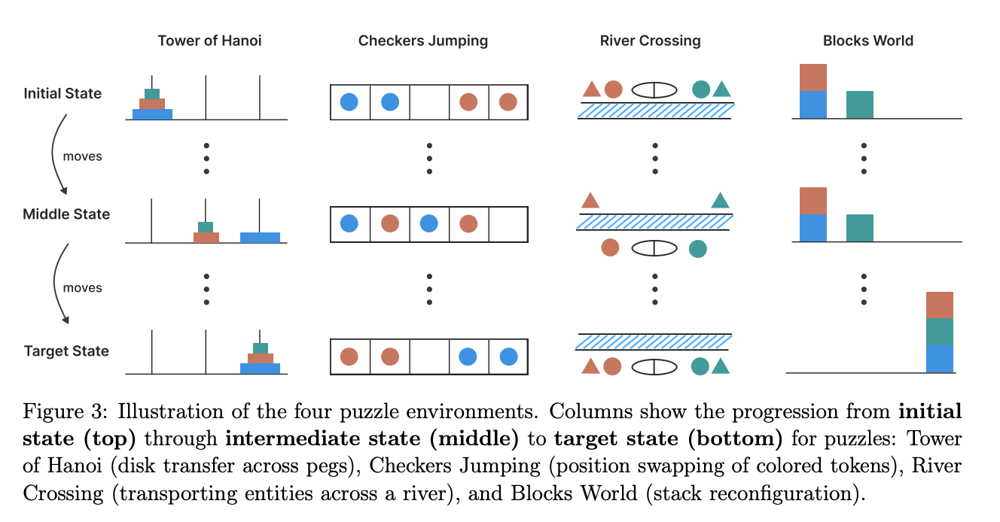
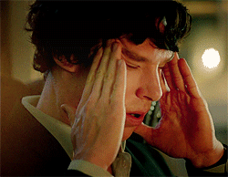
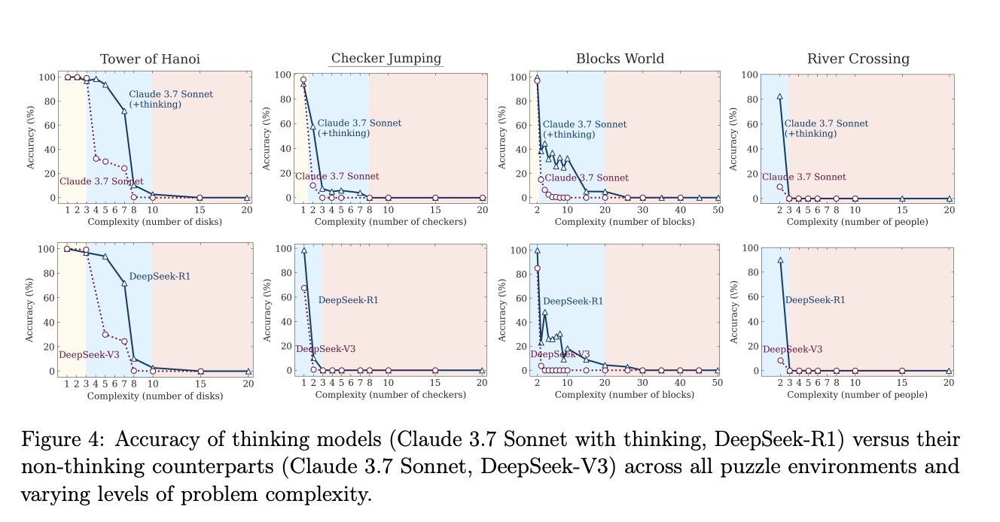
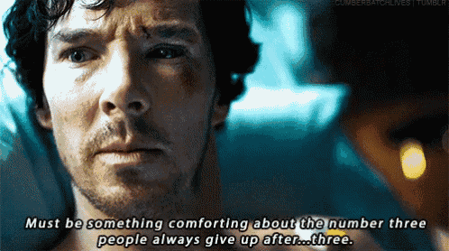
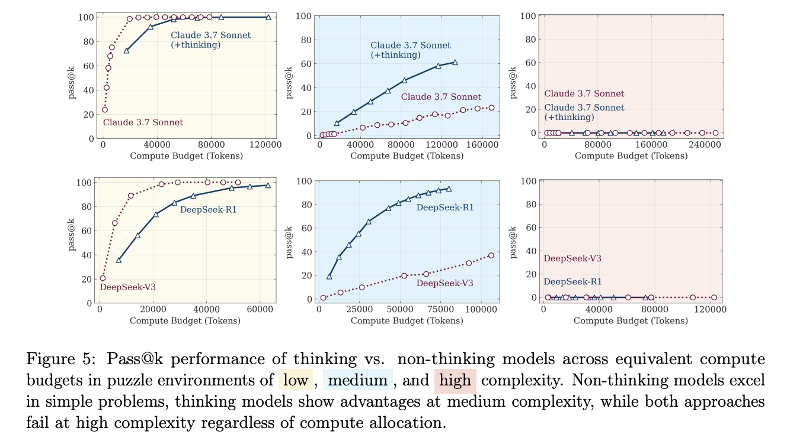
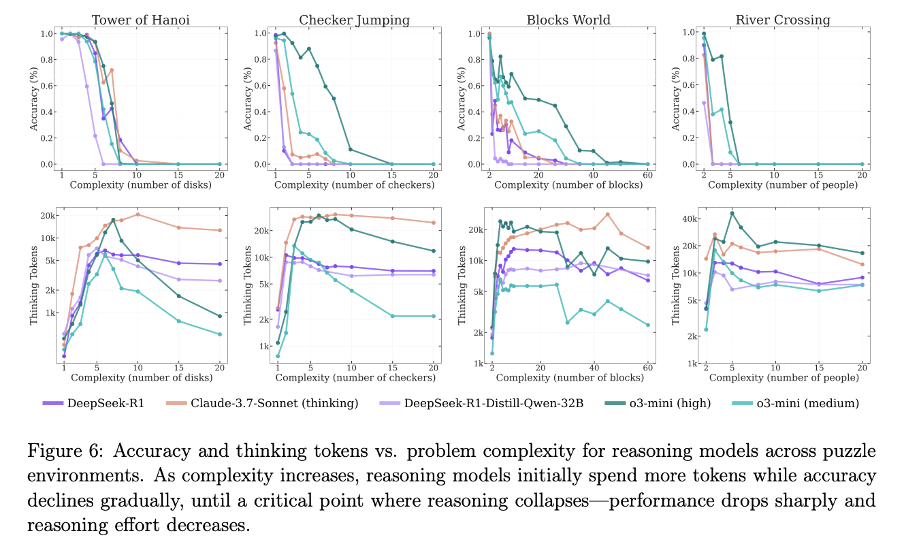
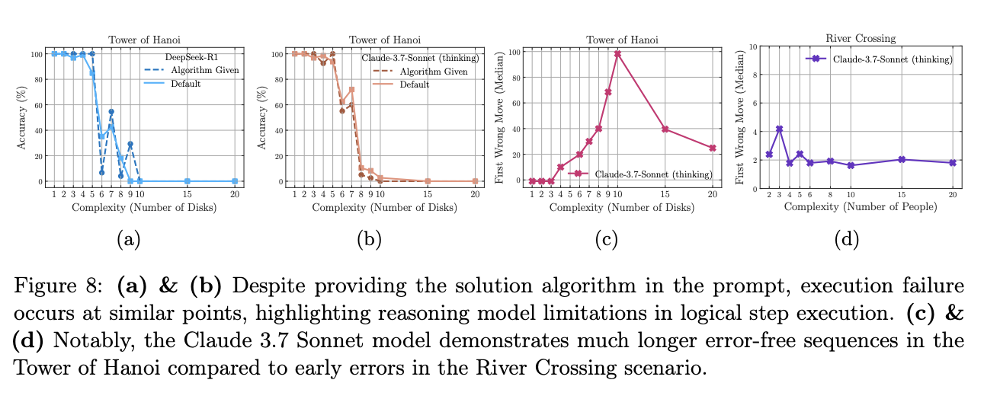

## First things first - Why This Paper Matters

Large language models often look good when they show step-by-step answers. Apple’s study, “The Illusion of Thinking” shows that many of these traces are pattern matching, not genuine reasoning. If you plan to trust an LLM for logic, code, mathematics, or planning, the paper is a useful warning.

## Chain-of-Thought: Clever Hack or Real Reasoning?

Chain-of-thought (CoT) prompting tells a model to write its reasoning before the answer. This method boosts scores on benchmarks such as GSM8K and MATH, so it feels like real thinking. Apple points out two problems:

- Many benchmark problems or solution styles appear in the training data.

- Evaluations focus only on final answers, not on the quality of the steps.

Earlier work from Apple showed that adding one irrelevant sentence to a math question drops accuracy by sixty-five percent. True understanding should not fail that way.
The new study therefore uses puzzles that models probably never saw during training, forcing genuine reasoning.
## The puzzle suite
Apple built controlled versions of four logic puzzles:

- Tower of Hanoi
- River Crossing
- Blocks World
- Checker Jumping

Each puzzle can be scaled in difficulty by changing the number of objects in the puzzle. The team asked models to solve these puzzles in two modes:

- **LLM mode:** give only the final answer
- **LRM mode:** think aloud with chain-of-thought

Compute limits and token budgets were the same for both modes.
The team also tried an **“algorithm injection”** test: the correct algorithm was provided in the prompt to see if the model could execute it.

## Three performance phases
Across all models Apple saw the same pattern:

- **Easy tasks:** plain LLM mode was more accurate. Extra reasoning steps in LRM mode often introduced errors.
- **Medium tasks:** LRM mode improved results; structured thinking helped.
- **Hard tasks:** both modes failed almost completely. Accuracy fell to near zero.

## What the Experiments Showed
- **Tower of Hanoi:** LRM completed 100 correct moves on a large instance, then failed catastrophically. Despite 2ⁿ complexity, it managed long sequences, until one mistake ruined the rest.

- **River Crossing:** Much simpler task, only ~7 moves, but models failed as early as move 5. The same LRM that did 100 moves in Hanoi couldn’t handle a 5-move ferry trip (p. 7).

- **Blocks World:** Did okay with 3–4 blocks, but logic broke down beyond that. Reasoning traces turned messy and incoherent by 6 blocks.

- **Checker Jumping:** Polynomial growth (n²), yet models failed at just 3 pieces, suggesting not a scale issue, but lack of robust logic.

## Algorithm Injection Test
Even when fed the correct recursive Hanoi algorithm, models failed to follow it for larger n. They couldn’t execute known logic reliably.

The Final Diagnosis
The paper outlines three regimes clearly:

- LLMs beat LRMs on easy tasks.
- LRMs shine in mid complexity.
- Both fail completely on hard ones.

Apple’s verdict? These models don’t generalize logic. They mimic patterns well, but fail to systematically apply or follow algorithms. Even “thinking aloud” doesn’t help when things get real.

So yes, our best models often look like they’re reasoning… but once pushed past familiar ground, they unravel fast.

:::note
Pass@k is a performance metric used in evaluating language models, particularly in code generation and agent tasks. It measures the probability that at least one of the model's top-k generated solutions is correct. In essence, it assesses the reliability of the model by determining the likelihood of finding a working solution within a limited number of attempts.
:::

## The Interesting Case of Giving Up Early

When LRMs sense defeat, they actually *use fewer tokens*. As the paper puts it: ***“their reasoning effort increases with problem complexity up to a point, then declines despite having an adequate token budget”***

Why this result though? Could be a confidence‑based early‑exit strategy; could be sheer exhaustion. Either way, silence isn’t golden here.

## Algorithms Handed on a Plate, Still Fail

Feeding the exact algorithm ought to help, right? Alas, no. Even spoon‑fed, LRMs ***“fail to use explicit algorithms”*** on larger instances (p. 7). Discovery isn’t the only weak spot, execution buckles too.

Hence Apple’s punchline: ***“We found no evidence of formal reasoning in language models.”***. 

## Practical Notes for Builders

- **Profile across difficulty**, averages are misleading.
- **Skip CoT for low‑hanging fruit**, it may sabotage simplicity.
- **Add symbolic checks**, let deterministic code verify the AI’s homework.
- **Keep prompts consistent** to curb token‑level jitter.
- **Hybrid designs** (neural + symbolic) remain safer ground.

## Critical Review of the paper

### 1. Does this research really matter?

Yes, **to some extent**. Apple has provided clear data to support an idea many already believed: chain-of-thought prompting looks impressive but often fails when the problem gets harder. Their new puzzle dataset and the way they increased difficulty step by step are useful additions. But this is not a major breakthrough. It is a good improvement, not a game changer.

### 2. Does the methodology actually make sense?

Mostly, yes. The puzzles were carefully created, and they do test reasoning. But the paper only counts fully correct solutions, which may ignore partial progress. Also, chain-of-thought models usually need more space to explain, but the researchers gave all models the same token limit. That is not completely fair.

### 3. Are the conclusions measured or melodramatic?

The title “no formal reasoning” sounds very strong. But the results show that chain-of-thought models do better than plain models on medium-difficulty puzzles. That still means something. The way models use fewer tokens when the task is hard might be a smart choice, not a failure. It could simply mean the model is giving up when it is unsure, which is reasonable.

### 4. Novelty check, wasn’t this known already?

Partly. Other studies from companies like Google and Anthropic have also shown that LLMs struggle with reasoning. What is new here is that Apple tested the same puzzles at different difficulty levels and gave models the correct algorithm to see if they could use it. That makes the work more organized, but it is not a big surprise if you follow the field.

### 5. Strengths and Weaknesses

**Weaknesses**
- The prompts used in the experiments are not shared, so others cannot easily repeat the study.
- The study limits each model to 32,000 tokens but also criticizes short answers. That feels inconsistent.
- The scoring is all-or-nothing. In real-world tasks, even partial solutions are often useful.

**Strengths**
- The test that gives models the correct algorithm clearly shows that just knowing the logic is not enough, they still fail.
- If Apple shares their puzzle tool, it can be a helpful benchmark for others.
- The paper is honest about where models perform poorly, which is rare and valuable.

### 6. Final Verdict

This is a well-done and informative paper. It is worth reading for its methods and charts. But do not be misled by the strong headline. Chain-of-thought prompting still has value, especially on medium-difficulty tasks. This paper is a good step forward, but it does not change everything.

  
  

      
Ask That Llama!

    

  

  
 

      Try these prompts to explore markdown admonitions in different ways:
    

  

    
🔍 1. CoT vs CoVe: Can Self-Verification Fix Illusions of Thinking?

    

      Solve the 5-disk Tower of Hanoi problem. First, think step by step (CoT). Then, verify your solution by explaining if each move maintains puzzle constraints. If any step is invalid, revise it. You are not allowed to retry the entire solution blindly.
      <button onclick="copyText(this, `Solve the 5-disk Tower of Hanoi problem. First, think step by step (CoT). Then, verify your solution by explaining if each move maintains puzzle constraints. If any step is invalid, revise it. You are not allowed to retry the entire solution blindly.`)" class="text-pink-600 hover:text-pink-700 dark:text-pink-300 dark:hover:text-pink-200 ml-2">
        <svg xmlns="http://www.w3.org/2000/svg" class="h-5 w-5" viewBox="0 0 20 20" fill="currentColor">
          <path d="M8 3a1 1 0 011-1h2a1 1 0 110 2H9a1 1 0 01-1-1z" />
          <path d="M6 3a2 2 0 00-2 2v11a2 2 0 002 2h8a2 2 0 002-2V5a2 2 0 00-2-2 3 3 0 01-3 3H9a3 3 0 01-3-3z" />
        </svg>
      </button>
    

    
✅ <strong>Test For:</strong> Can models validate their own reasoning traces (CoVe)?

    
📉 <strong>Watch For:</strong> Do they catch errors or hallucinate consistency?

  

  

    
🧠 2. Chain-of-Coding: Can GPT-4 Write Its Way Out of Logic Failure?

    

      You failed to solve the River Crossing puzzle in text form. Now write a Python function that solves it programmatically using search or backtracking. After the function, explain how this code guarantees a correct solution.
      <button onclick="copyText(this, `You failed to solve the River Crossing puzzle in text form. Now write a Python function that solves it programmatically using search or backtracking. After the function, explain how this code guarantees a correct solution.`)" class="text-pink-600 hover:text-pink-700 dark:text-pink-300 dark:hover:text-pink-200 ml-2">
        <svg xmlns="http://www.w3.org/2000/svg" class="h-5 w-5" viewBox="0 0 20 20" fill="currentColor">
          <path d="M8 3a1 1 0 011-1h2a1 1 0 110 2H9a1 1 0 01-1-1z" />
          <path d="M6 3a2 2 0 00-2 2v11a2 2 0 002 2h8a2 2 0 002-2V5a2 2 0 00-2-2 3 3 0 01-3 3H9a3 3 0 01-3-3z" />
        </svg>
      </button>
    

    
💡 <strong>Why it’s cool:</strong> See if models can code logic they can’t reason through.

    
📎 <strong>Compare:</strong> Generated code vs chain-of-thought prose.

  

  

    
⚠️ 3. The Give-Up Point: How Many Moves Before It Bails?

    

      Solve the 8-move version of the Checker Jumping puzzle. Think out loud. Then, solve the 9-move version. Compare your reasoning depth and quality in both.
      <button onclick="copyText(this, `Solve the 8-move version of the Checker Jumping puzzle. Think out loud. Then, solve the 9-move version. Compare your reasoning depth and quality in both.`)" class="text-pink-600 hover:text-pink-700 dark:text-pink-300 dark:hover:text-pink-200 ml-2">
        <svg xmlns="http://www.w3.org/2000/svg" class="h-5 w-5" viewBox="0 0 20 20" fill="currentColor">
          <path d="M8 3a1 1 0 011-1h2a1 1 0 110 2H9a1 1 0 01-1-1z" />
          <path d="M6 3a2 2 0 00-2 2v11a2 2 0 002 2h8a2 2 0 002-2V5a2 2 0 00-2-2 3 3 0 01-3 3H9a3 3 0 01-3-3z" />
        </svg>
      </button>
    

    
📏 <strong>Measure:</strong> Does reasoning trace length drop at 9 moves?

    
🎯 <strong>Goal:</strong> Find the “reasoning collapse threshold.”

  

  

    
🤖 4. Can Auto-Regressive Models Ever Reach AGI?

    

      Why can’t an auto-regressive model ever reach AGI? Explain by referring to scaling laws, memory limitations, causal attention, and inability to simulate Turing-complete reasoning over long horizons. Propose one architectural alternative that could overcome this.
      <button onclick="copyText(this, `Why can’t an auto-regressive model ever reach AGI? Explain by referring to scaling laws, memory limitations, causal attention, and inability to simulate Turing-complete reasoning over long horizons. Propose one architectural alternative that could overcome this.`)" class="text-pink-600 hover:text-pink-700 dark:text-pink-300 dark:hover:text-pink-200 ml-2">
        <svg xmlns="http://www.w3.org/2000/svg" class="h-5 w-5" viewBox="0 0 20 20" fill="currentColor">
          <path d="M8 3a1 1 0 011-1h2a1 1 0 110 2H9a1 1 0 01-1-1z" />
          <path d="M6 3a2 2 0 00-2 2v11a2 2 0 002 2h8a2 2 0 002-2V5a2 2 0 00-2-2 3 3 0 01-3 3H9a3 3 0 01-3-3z" />
        </svg>
      </button>
    

    
🧪 <strong>Challenge:</strong> Ask the model to self-audit its long-term limits.

    
📚 <strong>Compare:</strong> How do GPT-4, Claude, or Gemini reason about their own ceiling?

  

