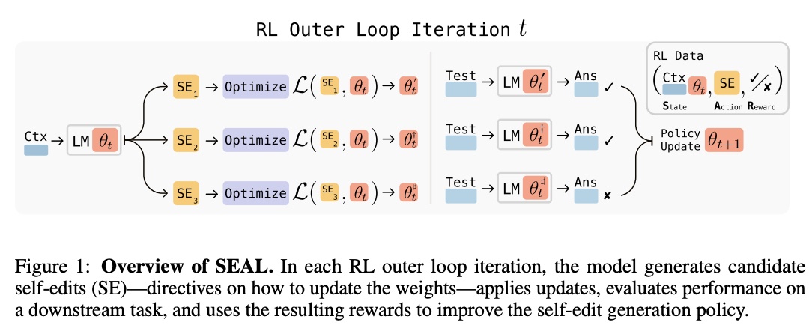
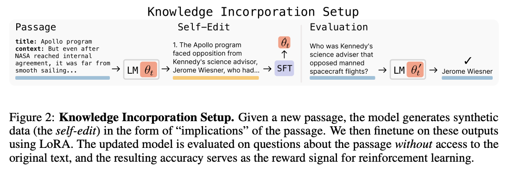
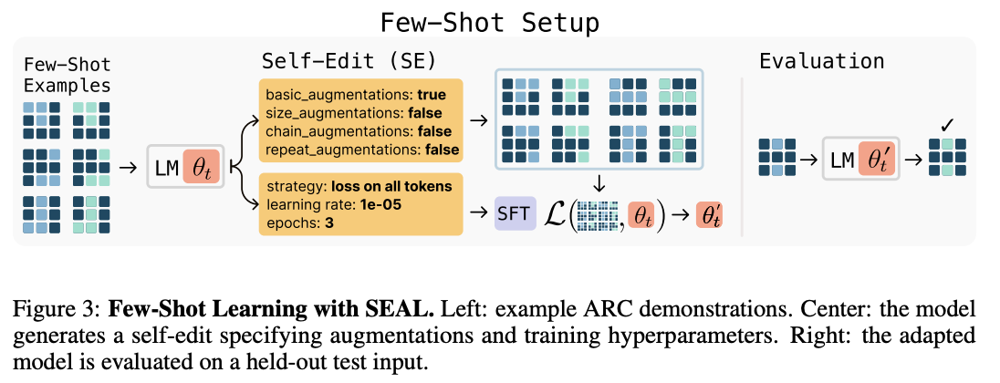

## First things first – Why This Paper Matters

Large language models (LLMs) are **powerful but static**: once trained, they can't easily incorporate new information or adapt to novel tasks without expensive retraining. In practice this means your chatbot's knowledge freezes at the training cutoff, and it "forgets" any new breakthroughs after that. Common fixes – fine-tuning (slow, data-hungry), in-context tricks (limited examples), or search tools (still only in-context) – have serious drawbacks.

**Self-Adapting LLMs (SEAL)** tackles this head-on. Rather than treating an LLM as a fixed function, SEAL teaches it to **generate its own training data and update instructions**. In other words, the model literally writes the lesson plan for its next round of learning. The paper's core claim is that an LLM can use its own output (a "self-edit") to finetune itself and thus *persistently* update its knowledge. This could be a game-changing leap toward LLMs that don't just parrot their training data, but actually **self-improve over time**. In fact, experiments on adding new facts and tackling few-shot problems show SEAL is *"a promising step toward language models capable of self-directed adaptation"*. That's why this MIT study matters: it's an early stab at continuous learning for LLMs, pushing us past the static mindset.

## Core Concept Explanation

At SEAL's heart lies a **self-edit**. Suppose you hand the model a Wikipedia paragraph about Mars. The model is asked to:

1. **Generate a helpful derivative of that paragraph** – for example,  
   - a bullet list of salient facts,  
   - a set of *question → answer* pairs, or  
   - a short explanation aimed at sixth-graders.  
2. **Fine-tune itself on that derivative** using a tiny, fast adapter (LoRA).  
3. **Check whether its post-update answers actually improved.**

That sequence yields **two nested loops**:

| Loop | Who does the work? | What happens? | Frequency |
|------|-------------------|---------------|-----------|
| **Inner loop (learning)** | LLM + LoRA | Apply the freshly generated self-edit as training data and update weights. | Once per self-edit |
| **Outer loop (selection)** | Reinforcement Learning (ReST-EM) | Keep only the self-edits that *improve* the model on held-out questions; discard the rest. | Repeats for many batches |

:::note[What is **ReST-EM?**]
**Re**jection **S**ampling + **T**raining with an **E**xpectation-**M**aximisation flavour:  
sample several self-edits ➔ keep the ones that raise accuracy ➔ do supervised fine-tuning on those winners ➔ repeat.  
It’s cheaper and stabler than PPO, yet still counts as RL because “reward” = downstream score.  
:::

  
*Figure 1: Overview of the SEAL framework. In each iteration the model generates candidate self-edits, applies them via weight updates, then uses the resulting performance to refine its editing policy.*

## Experimental Setup

SEAL is validated on two complementary tasks:

- **Knowledge Incorporation (SQuAD passages)**  
  The model sees a news-style paragraph *once*, must absorb the facts, and later answer questions *without* the paragraph.

  :::note[What is **SQuAD?**]
  **S**tanford **Qu**estion **A**nswering **D**ataset – short passages (≈ 100 words) plus WH-questions whose answers are spans inside the passage.  
  For SEAL, the passages are removed during testing, forcing the model to rely on its updated weights.  
  :::
  
- **Few-Shot Reasoning (ARC puzzles)**  
  The model gets a handful of coloured-grid puzzles and must infer the underlying pattern to solve a new grid.

  :::note[What is **ARC?**]
  The **A**bstraction & **R**easoning **C**orpus is a benchmark of tiny grid puzzles (think “baby Sudoku”).  
  Each task contains 3–5 input → output examples; the model must transform a new input grid in the same way.  
  Humans solve via abstraction, not brute force, so ARC is a stress-test for reasoning.  
  :::

For both tasks SEAL is compared against:

| Baseline | Description |
|----------|-------------|
| **Frozen model** | No updates, no context (hardest). |
| **Prompt-only / CoT** | Careful in-context examples, but no weight updates (ARC only). |
| **Raw fine-tune** | Fine-tune on the passage itself (SQuAD) or simple augmentations (ARC). |
| **Synthetic-data w/o RL** | Let the base model (or GPT-4.1) generate extra data, *then* fine-tune once. |

All runs use small LoRA adapters so each inner-loop update costs seconds, not hours.

## Evaluation Strategy (what “better” means)

1. **Exact-match accuracy**  
   - *SQuAD:* answer string must match the ground-truth span.  
   - *ARC:* produced grid must equal the target grid pixel-perfectly.

2. **Pass@1 vs. Pass@k**  
   For ARC, the authors take the *best* of *k* self-edits; Pass@k reports the chance at least one edit solves the puzzle. Main table shows k = 5.

3. **Reward signal in RL**: +1 if the accuracy after the update is higher than before; 0 otherwise.

4. **Catastrophic forgetting check**  
   After many sequential edits, they re-test old questions to see how much performance dropped.
   
## Performance Breakdown

SEAL showed notable gains over baseline approaches in both experiments:

- **Adding New Facts (SQuAD):** Without any adaptation, the base model gets about **32.7%** of questions right on a passage (no context). Fine-tuning on the raw passage only barely helps. Using synthetic data from a stronger model (GPT-4.1) gives ~46.3% accuracy. Crucially, after two rounds of SEAL's RL loop, the model jumps to **47.0%** – beating even the GPT-4.1 data without being that large.

- **Many Passages:** When given *200 passages* in sequence, SEAL again tops the chart at **43.8%** correct, compared to ~39.4% using GPT-4.1 synthetic data and ~32–41% for other baselines.

- **Few-Shot Learning (ARC):** The ARC questions were extremely challenging without learning: zero-shot in-context fails completely (0% success). Simply finetuning on naive self-edits (without RL) yields 20%. With SEAL's self-directed training, success soars to **72.5%**.

  
*Figure 2: Knowledge integration accuracy on SQuAD-style tasks.*
  
*Figure 3: Few-shot generalization (ARC task).*

## Practical Notes for Researchers & Builders

- **Check for catastrophic forgetting:** Measure what new training overwrites. Consider hybrid fixes (retrieval augmentation, regularization).  
- **Budget for compute:** SEAL's RL loop is GPU-intensive. Profile carefully.  
- **Align token budgets:** Chain-of-thought self-edits may need more tokens. Adjust context length accordingly.  
- **Compare to strong baselines:** SEAL outperformed GPT-4.1 synthetic data – test against top-tier generators.  
- **Combine neural and symbolic:** Use test suites or symbolic checkers to verify neural self-learning outputs.  

## Critical Review of the paper

### 1. Does this research really matter?  
Yes. It moves beyond prompt tricks toward *persistent* model improvement, a core need for real-world deployments. But is this really "learning" or just "memorizing", I leave that upto you to decide!

### 2. Does the methodology actually make sense?  
Mostly. Using RL with an inner LoRA-based update is sensible, but the approach is compute-heavy and bounds chain-of-thought prompt lengths.

### 3. Are the conclusions measured or melodramatic?  
The authors are appropriately cautious, calling SEAL "a promising step" rather than a revolution.

### 4. Novelty check: wasn't this known already?  
Similar synthetic data generation exists, but SEAL's RL-driven self-edit policy and end-to-end evaluation is novel. That said,
you won't be wrong in suspecting if OpenAI, Meta and others might have something similar going for themselves already.

### 5. Strengths and Weaknesses  
**Strengths:** Code released, convincing benchmarks, honest limitations.  
**Weaknesses:** Toy tasks, compute costs, catastrophic forgetting, prompt sensitivity, SEAL needs to be tested & improved on more "reasoning" based benchmarks 

### 6. Final Verdict  
A well-executed proof-of-concept that opens an exciting direction for continuous LLM learning. Not a silver bullet, but a strong foundation for future work.

:::tip[Stop and Ponder]
**Remember Apple's ["Illusion of Thinking"](/posts/illusion-of-thinking-debunked/illusion-of-thinking-debunked/)?:** their puzzles showed CoT's *brick wall* when models left familiar patterns.   

**Question:** Are these two failure modes, Apple's inability to generalize beyond novel puzzles and SEAL's catastrophic forgetting, two sides of the same coin?  
**Answer:** They rely on distributed weight representations that aren't modular or symbolic, so pushing them beyond familiar territory or repeatedly overwriting those weights leads to dramatic breakdowns.  
:::

---

  

    <picture>
      <source srcset="/icons/optimized/llama-32.png" media="(max-width: 639px)">
      <source srcset="/icons/optimized/llama-40.png" media="(min-width: 640px)">
      
    </picture>
    

      
Ask That Llama!

    

  

  

    

      Try these prompts on your favorite LLM to explore more about this topic by yourself:
    

    

      
🧪 1. Explore concrete reasoning about when to update weights versus stay stateless.

      

        
          Compare lifelong-learning Strategy A (SEAL self-edits + weight updates) versus Strategy B (retrieval-augmented generation with an external memory). For five everyday user queries, decide which strategy would respond better and explain your reasoning.
        
        <button onclick="copyText(this, `Compare lifelong-learning Strategy A (SEAL self-edits + weight updates) versus Strategy B (retrieval-augmented generation with an external memory). For five everyday user queries, decide which strategy would respond better and explain your reasoning.`)" class="text-pink-600 hover:text-pink-700 dark:text-pink-300 dark:hover:text-pink-200 ml-2">
          <svg xmlns="http://www.w3.org/2000/svg" class="h-5 w-5" viewBox="0 0 20 20" fill="currentColor">
            <path d="M8 3a1 1 0 011-1h2a1 1 0 110 2H9a1 1 0 01-1-1z" />
            <path d="M6 3a2 2 0 00-2 2v11a2 2 0 002 2h8a2 2 0 002-2V5a2 2 0 00-2-2 3 3 0 01-3 3H9a3 3 0 01-3-3z" />
          </svg>
        </button>
      

    

    

      
🧠 2. GIGO:  Garbage-In-Garbage-Out?

      

        
         If SEAL keeps training on its own noisy or low-quality self-edits, won’t it just amplify errors over time? How can we avoid a garbage-in-garbage-out spiral in a continuous learning loop, and is this risk really serious?
        
        <button onclick="copyText(this, `If SEAL keeps training on its own noisy or low-quality self-edits, won’t it just amplify errors over time? How can we avoid a garbage-in-garbage-out spiral in a continuous learning loop, and is this risk really serious?`)" class="text-pink-600 hover:text-pink-700 dark:text-pink-300 dark:hover:text-pink-200 ml-2">
          <svg xmlns="http://www.w3.org/2000/svg" class="h-5 w-5" viewBox="0 0 20 20" fill="currentColor">
            <path d="M8 3a1 1 0 011-1h2a1 1 0 110 2H9a1 1 0 01-1-1z" />
            <path d="M6 3a2 2 0 00-2 2v11a2 2 0 002 2h8a2 2 0 002-2V5a2 2 0 00-2-2 3 3 0 01-3 3H9a3 3 0 01-3-3z" />
          </svg>
        </button>
      

    

    

      
⚠️ 3. Limitations of Self-Learning: Why can't this scale forever?

      

        
          Why might a purely autoregressive model (like GPT-4) struggle to continuously improve itself forever, even with unlimited data? Discuss factors like scaling laws, memory limits, catastrophic forgetting, and gradient descent. Suggest one architectural change that could help a model truly learn in perpetuity.
        
        <button onclick="copyText(this, `Why might a purely autoregressive model (like GPT-4) struggle to continuously improve itself forever, even with unlimited data? Discuss factors like scaling laws, memory limits, catastrophic forgetting, and gradient descent. Suggest one architectural change that could help a model truly learn in perpetuity.`)" class="text-pink-600 hover:text-pink-700 dark:text-pink-300 dark:hover:text-pink-200 ml-2">
          <svg xmlns="http://www.w3.org/2000/svg" class="h-5 w-5" viewBox="0 0 20 20" fill="currentColor">
            <path d="M8 3a1 1 0 011-1h2a1 1 0 110 2H9a1 1 0 01-1-1z" />
            <path d="M6 3a2 2 0 00-2 2v11a2 2 0 002 2h8a2 2 0 002-2V5a2 2 0 00-2-2 3 3 0 01-3 3H9a3 3 0 01-3-3z" />
          </svg>
        </button>
      

    

  

